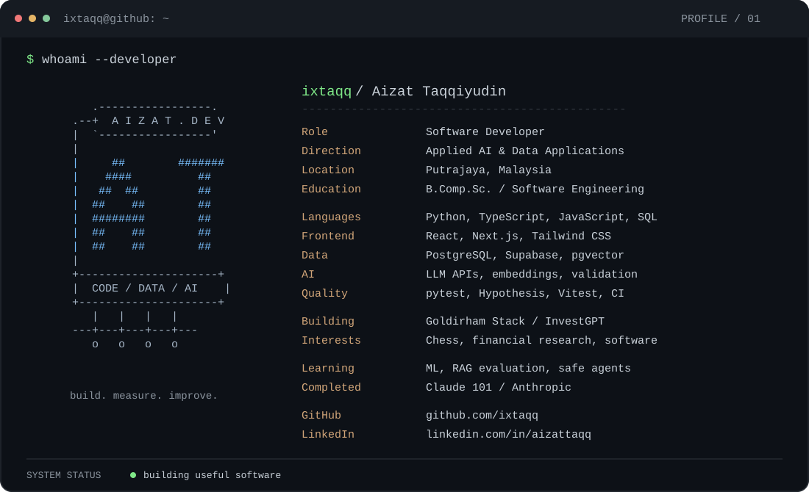

<!-- Profile README for github.com/ixtaqq. -->
<p align="center">
  
</p>

<p align="center">
  <a href="https://www.linkedin.com/in/aizattaqq/">LinkedIn</a> &nbsp; / &nbsp;
  <a href="https://goldirham-stack.vercel.app/">Goldirham Stack</a> &nbsp; / &nbsp;
  <a href="https://goldirham.vercel.app/">Goldirham</a>
</p>

### `$ cat about.txt`

I'm **Aizat Taqqiyudin**, a software developer in Putrajaya, Malaysia, with a Computer Science (Software Engineering) degree from UNITEN and experience developing internal web applications and interfaces at GFIS.

I build **Python and TypeScript applications** that turn data into useful products: AI-assisted research pipelines, Telegram briefings, interactive dashboards, and browser applications. My engineering focus is on clear interfaces, deterministic calculations, validated model output, automated tests, and reliable delivery.

### `$ ls projects/`

| Project | What I built | Stack |
| :--- | :--- | :--- |
| [Goldirham Stack](https://github.com/ixtaqq/ai-infra-digest) | AI infrastructure intelligence from news, SEC filings, and earnings transcripts, with two-tier AI routing, personalized briefings, and a web dashboard. | TypeScript, Supabase, pgvector, Zod, Vitest |
| **InvestGPT** | Investment research and Telegram briefings with deterministic financial calculations, optional validated AI commentary, PostgreSQL persistence, and automated tests. | Python, PostgreSQL, SQLAlchemy, pytest, Hypothesis |
| [Goldirham](https://github.com/ixtaqq/Goldirham) | Asset research, interactive charts, and upside / safety / AI-exposure scoring, with clearly labeled live and simulated data. | Next.js, React, TypeScript |
| [Chess Club](https://github.com/ixtaqq/chess) | Browser chess with local two-player mode, a computer opponent, cancellable Web Worker search, FEN import, and PGN export. | Next.js, TypeScript, chess.js |
| [Personal Portfolio](https://github.com/ixtaqq/aizat-website) | Responsive developer portfolio with a CV viewer and a profile-aware AI chat endpoint. | Next.js, React, Anthropic SDK |

### `$ cat learning.log`

- **Completed:** Claude 101, Anthropic - Certificate of Completion.
- **Current career direction:** Applied AI Engineering, building on my software development experience.
- **Learning plan:** ML fundamentals, measurable retrieval and LLM evaluation, bounded agents, observability, security, and cloud deployment.

### `$ cat principles.txt`

```text
01  Let code own facts and arithmetic.
02  Validate model output before using it.
03  Test failure paths as well as happy paths.
04  Measure quality, latency, and cost.
05  Build useful systems and explain the trade-offs.
```